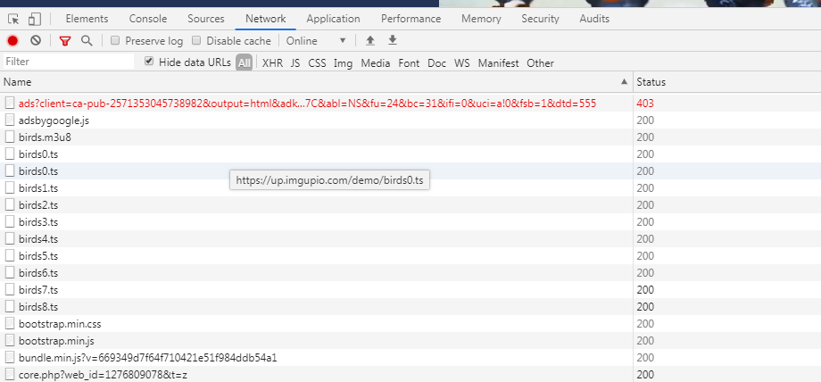

最近项目要对接监控设备，和之前使用的RTSP协议(Real Time Streaming Protocol，实时流传输协议)不同，这次采用m3u8-HLS视频协议
 <!-- more -->
## HLS介绍：
`HLS 全称是 HTTP Live Streaming，是 Apple 提出的流媒体协议`
- M3U8是一种文件格式，是某些移动设备例如安卓，苹果手机浏览器缓存视频的“专用视频格式”。M3U8文件是指UTF-8编码格式的M3U文件，相当于M3U的特例情况。M3U文件是记录了一个索引纯文本文件，打开它时播放软件并不是播放它，而是根据它的索引找到对应的音视频文件的网络地址进行在线播放。
- M3U是一种播放多媒体列表的文件格式，它的设计初衷是为了播放音频文件，比如MP3，但是越来越多的软件现在用来播放视频文件列表，M3U也可以指定在线流媒体音频源。很多播放器和软件都支持M3U文件格式。
- M3U8主要的优点是可以做多码率的适配，根据网络带宽，客户端会自动选择一个适合自己码率的文件进行播放，保证视频流的流畅。它主要应用在移动设备上。


## 协议分析
由于项目属于内网项目，开发测试时无法获取到真实视频数据，只能总网上找一些m3u8格式的视频地址去测试，这里发现的一个可以直接播放m3u8格式地址的测试网站
[https://www.m3u8play.com/](https://www.m3u8play.com/),所以借助这个网站梳理下，
打开控制台后刷新一下页面，重新加载资源后可以看到下面这些东东，红框里面的两个文件， 对于用hls协议来解析一段视频来说，客户端通过xhr获取到的文件就是.m3u8 文件及对应的 .ts二进制流文件，服务端存储一份.m3u8文件然后对应了很多份的.ts流文件，可以理解成一对多的关系，.m3u8文件也类似于索引文件。

点击.msu8文件，可以看到下面这些内容，

红框里的是.mu38文件的头信息，是对视频资源的描述，下面就是索引列表，排列着视频的分片.ts流文件，下载下来后通过合并流文件最终形成视频播放文件
```js
#EXT-X-VERSION:3            PlayList 的版本，可带可不带。下面有说明
#EXTM3U                     m3u文件头
#EXT-X-TARGETDURATION:11    分片最大时长，单位为 s
#EXT-X-MEDIA-SEQUENCE:0     第一个TS分片的序列号，如果没有，默认为 0
#EXT-X-ALLOW-CACHE          是否允许cache
#EXT-X-ENDLIST              m3u8文件结束符
#EXTINF                     指定每个媒体段(ts)的持续时间（秒），仅对其后面的URI有效
```
读到这里可能有点纳闷，为啥只有一个.ts文件呢？不是一对多吗？不着急，当然是一对多，只不过刚打开页面，视频没有设置自动播放，所以只下载了一个分片的.ts文件，当点击开始播放按钮后，就开始下载了


## 项目实践
我们要把视频资源放到video元素上来播放，可是原生的video只支持MP4、OGG、WebM这几种格式，无法对m3u8格式进行直接解析播放，这里要借助`videojs/videojs-contrib-hls`的方案来解决，videojs它支持多个播放核心，而且插件非常多,还会自动检测浏览器对 HTML5 的支持情况，如果不支持 HTML5 则自动使用 Flash 播放器。

- 安装(根据项目选择引入方法)，css是必须引入的，要不然整个样式就会乱掉，由于是内网项目所以就直接考了一份。
```js
<link href="https://vjs.zencdn.net/7.5.5/video-js.css" rel="stylesheet" />

//es6
npm install --save-dev video.js
npm install --save-dev videojs-contrib-hls
//cdn
//If you'd like to support IE8 (for Video.js versions prior to v7)
  <script src="https://vjs.zencdn.net/ie8/1.1.2/videojs-ie8.min.js"></script>
```

- 安装成功完成后，就可以引入包使用了，这里封装成了一个组件，因为项目中需要从服务器中动态加载多个不同m3u8格式视频源，所以需要通过一个唯一值token来区分不同的摄像头，如果没有这个需求，直接在source中把路径写死就行了

```js
import React, { Component } from 'react';
import videojs from 'video.js';
let player=null;
class CreateVideo extends Component {
    constructor(props) {
        super(props);
        this.state = {
        }
    }
    componentDidMount() {
        this.createVideoDom()
    }
    componentDidUpdate() {
        this.createVideoDom()
    }
    createVideoDom = () => {
        const { token } = this.props;
        const domId = document.getElementById('myVideo' + token);
        const options = {
            bigPlayButton: false,//显示播放按钮
            autoplay: true,
            controls: true,//显示操作控件
            controlBar: { fullscreenToggle: true },
            sources: [{ src: `http://server/hls/${token}.m3u8`, type: 'application/x-mpegURL' }],
            // sources: [{ src: 'https://node.imgio.in/demo/birds.m3u8', type: 'application/x-mpegURL' }],
            // sourceOrder: true
        };
        //初始化播放实例
        this.player = videojs(domId, options, function onPlayerReady() {
            this.load()
            const playPromise = this.play();
            if (playPromise !== undefined) {
                playPromise
                    .then(() => {
                        console.log("audio played auto");
                    })
                    .catch(() => {
                        console.log("playback prevented");
                    });
            }
            // How about an event listener?
            this.on('ended', function () {
                console.log("结束");
            });
        });
        this.player.on("error", function (err) {
            console.log("连接异常", err);
        })

    }
    componentWillUnmount() {
        console.info('断开视频连接')
        if (this.player) {
            this.player.dispose();//销毁实例
        }
        this.player = null;
    }
    render() {
        const { height, token, time } = this.props;
        return <div style={{
            width: 'inherit',
            height: 'inherit',
            positoin: "relative"
        }}>
            <video time={time} className="video-js vjs-default-skin" controls preload="auto" style={{
                width: 'inherit',
                height: 'inherit',
                background: '#000'
            }} height={height}
                id={"myVideo" + token}>
                <source
                    type="application/x-mpegURL"></source>
            </video>
        </div>

    }
}
```
>想看更多功能传送门在此 [https://videojs.com/](https://videojs.com/)

- 添加双击全屏需要引入`videojs-hotkeys`包，这个包不支持npm安装，建议直接去github复制下来，代码也没多少;引入成功后就支持双击全屏，当然还有很多配置项，可以参考文档
>[https://github.com/ctd1500/videojs-hotkeys](https://github.com/ctd1500/videojs-hotkeys)
```js
//cdn
<script src="//cdn.sc.gl/videojs-hotkeys/latest/videojs.hotkeys.min.js"></script>
```


