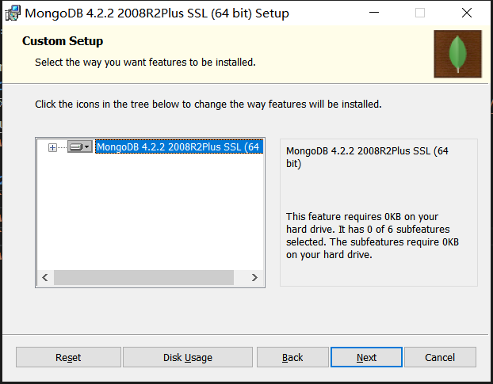

> os：win10-64bit
> 
> mongodb-version：4.2.2
### 1、下载安装包
去官网根据自己的系统下载安装包[https://www.mongodb.com/download-center/community](https://www.mongodb.com/download-center/community),有`msi安装程序`和`zip包`两种，这里下载的是前者。


### 2、安装
双击`mongodb-win32-x86_64-2012plus-4.2.2-signed.msi`安装程序


点击`next`后选择`custom`自定义配置


这个地方其实是可以配置安装路径的
> 不过我已经安装过了，所以不用选择



服务配置默认选择就好


然后的操作一路next就ok了

### 3、配置
打开安装目录
- 在`data`文件夹下新建`db`文件夹，用以存放数据
- 在`data`文件夹下再创建`log`文件夹，然后新建`mongod.log`文件，用以存放日志信息

上述步骤完成后，打开bin文件夹下的配置文件`mongod.cfg`，修改storage下的`dbpath`和systemLog下的`path`，分别配置刚才的新建好的文件夹的绝对路径
``` cfg
storage:
  dbPath: F:\software\mongoDB\data\db  //数据文件  此处=后对应到数据所存放的目录
  journal:
    enabled: true    //启用日志文件，默认启用
#  engine:
#  mmapv1:
#  wiredTiger:

# where to write logging data.
systemLog:
  destination: file
  logAppend: true //错误日志采用追加模式，配置这个选项后mongodb的日志会追加到现有的日志文件，而不是从新创建一个新文件
  path:  F:\software\mongoDB\data\log\mongod.log  //日志文件  此处=后对应到日志文件所在路径
```


### 4、安装服务
配置完成后用管理员身份启动cmd或者powershell，用命令进入安装目录下的bin文件夹
``` cfg
`mongod --logpath "F:\software\mongoDB\data\log\mongodb.log" --logappend --dbpath "F:\software\mongoDB\data\db" --serviceName "MongoDB" --install`
```

### 5、启动mongodb服务
直接进入安装目录下的bin文件夹，找到`mongo.exe`，点击运行


::: warning 需配置换环境变量
也可以使用命令`net start mongodb`来启动，

首次启动失败先删除服务,使用命令
`sc delete MongoDB`
:::

### 结语
 
至此已经可以成功运行服务了，其实还可以配置换环境变量，用以命令操作更方便，直接把安装目录下的`bin`文件夹绝对路径复制到系统变量`path`中即可，和配置其他开发环境时的套路一样，这个太过简单就不做介绍了


