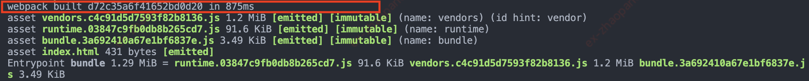
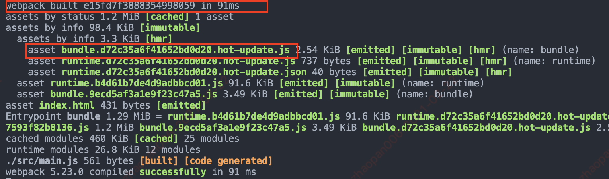
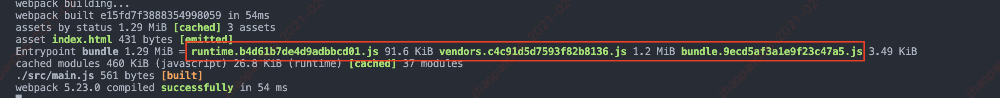
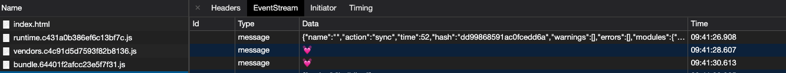
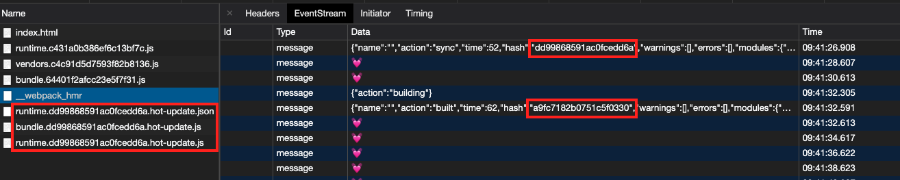
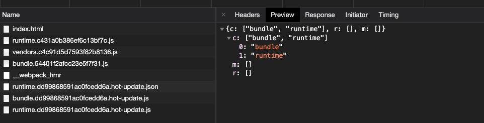
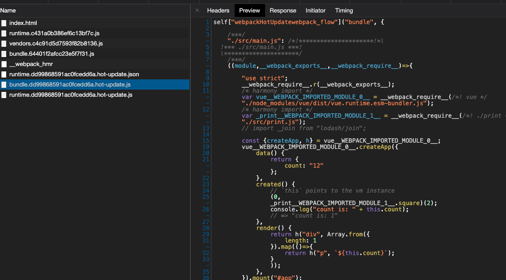
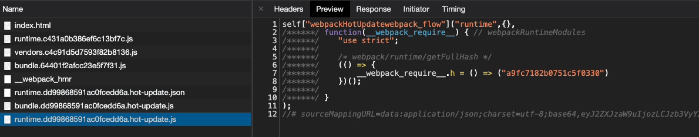
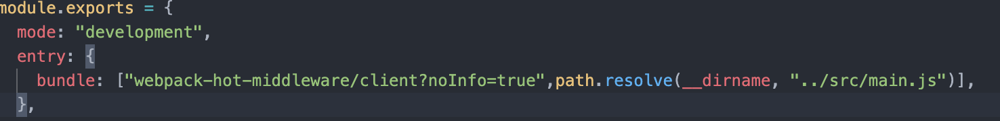

## webpack-热更新
> vue 脚手架基础依赖：Webpack + koa + Webpack-Dev-Middleware + Webpack-Hot-Middleware

开发过程中，一直很享受`command/ctrl+s`一键...哦不两键保存-编译带来的快感，但是背后的原理是怎么运行的呢？

首先抛开 webpack 官方的`webpack-dev-server`,虽然`webpack-dev-server`确实很方便，但是对于想定制化 webpack 配置来说，他隐藏了太多细节，显得不够灵活。所以采用了开头说的基础配置。

> `webpack-dev-server`稍作介绍下，服务器端用的是`express`，我们这边采用`koa`;热更新通信运用的`websocket`全双工通道双向通信协议，相同的地方是都依赖了`Webpack-Dev-Middleware`

### 构建

先从`npm start`开始吧，项目启动之后，控制台会输出整个构建过程，可以看到生成的 hash 值 `d72c35a6f41652bd0d20`


这时当我们修改了页面内容后点击`command/ctrl+s`，首先控制台会出现`compiling...`的字样，然后从控制台可以发现，生成了新的 hash 值`e15fd7f3888354998059`，而且上次输出的 Hash`d72c35a6f41652bd0d20`值被作为本次编译新生成的 hmr 文件标识,同理这次生成的 hash 值`e15fd7f3888354998059`将会成为下次更新后的 Hmr 文件标识



但是如果只是点击`command/ctrl+s`，而不做内容修改，hash 值是不会改变的`e15fd7f3888354998059`


### Watch

为啥点击`command/ctrl+s`后就会自动编译呢？这里主要是因为底层`webpack`用了`watch`这个包，提供了管理文件和监听文件树的能力，
项目启动构建完成后，会调用 watch 方法的文件监听，只要文件有变化就会触发重新编译，编译成功后继续监听。

### Webpack-Dev-Middleware

上面说了 Webpack 通过`watch`监听文件变化，然后编译构建新的 bundle，可以有个问题是每次打包后会把文件直接放到本地磁盘，通常我们会开启一个服务器来访问页面，当有页面请求时，从硬盘读取打包文件，不过，这种 IO 操作是种很消耗资源并耗时的低效操作，对于开发调试编译很频繁，且时效性要求很高的日常开发来说无法满足。这里就要用到 Webpack-Dev-Middleware 这个中间件了

```js
const koa = require("koa");
const koaWebpackDevMiddleware = require("./img/middleware/koa-webpack-dev-middleware");
const webpackConfig = require("./img/webpack.dev.config.js");

const app = new koa();
const compiler = webpack(webpackConfig);

app.use(
  koaWebpackDevMiddleware(compiler, {
    publicPath: webpackConfig.output.publicPath,
    // stats: "errors-only",
  })
);
```

> 示例的服务器用了 koa，所以包了封装了一层以便支持 koa，包装方式传送门->

webpack-dev-middleware 是一个封装器(wrapper)，它可以把 webpack 处理过的文件发送到一个 server(koa/express)，在其内部使用`memfs`替换掉 compiler 的文件系统对象，实现了对内存文件的存储和访问，提高了存储读取效率。

```js
outputFileSystem = (0, _memfs.createFsFromVolume)(new _memfs.Volume());
```

当有静态资源请求时，就可以直接从内存中读取

### client

接下来我们把目光转向浏览器，打开 network，会发现有个\_\_webpack_hmr 的请求，然后点开`EventStream`，第一行的 data 是我们第一次启动项目编译成功后的信息,可以看到有名称，编译时间，action 类型，编译产生的 hash 值，如果有问题还会有若干警告和错误信息.



这时我们修改项目内容并保存编译后，会发现有新的请求和最新编译收到的 💓，里面`a9fc7182b0751c5f0330`就是最新编译产生的 hash 值

- runtime.dd99868591ac0fcedd6a.hot-update.json
- bundle.dd99868591ac0fcedd6a.hot-update.js
- runtime.dd99868591ac0fcedd6a.hot-update.js



这些请求名中间的 hash 值都是上一次更新生成的 hash 值，验证了我们上面的说法，点开`runtime.dd99868591ac0fcedd6a.hot-update.json`，
c 里面包括要更新的文件



打开`bundle.dd99868591ac0fcedd6a.hot-update.js`,返回的内容就是我们此次更改代码编译后的最新结果



在看`runtime.dd99868591ac0fcedd6a.hot-update.js`这个是引导程序的内容,包含了这次更新产生的 hash 值，下次更新需要的用到



#### Webpack-Hot-Middleware

看到这里就纳闷了，浏览器的这些请求是怎么获取到 webpack 最新的编译结果的呢？这里就要我们的`Webpack-Hot-Middleware`中间件发挥作用了，断点进入源码不难发现，在加载中间件开始的地方就先创建了一个`EventStream`,`"Content-Type": "text/event-stream;charset=utf-8"`这句很关键，服务端大概的流程如下

> > EventStream 事件流:服务器端事件流，服务器向浏览器推送消息，除了 websocket 全双工通道双向通信方式还有一种 Server-Sent Events 单向通道的通信方法，只能服务器端向浏览器端通过流信息的方式推送消息；页面可以通过 EventSource 实例接收服务器发送事件通知并触发 onmessage 事件

> 以下源码位置：`webpack-hot-middleware/middleware.js`

```js
function webpackHotMiddleware(compiler, opts) {
  //   省略...
  if (compiler.hooks) {
    compiler.hooks.invalid.tap("webpack-hot-middleware", onInvalid);
    compiler.hooks.done.tap("webpack-hot-middleware", onDone); //编译结束后会调用EventStream的publish方法 发布新的构建结果信息
  }

  var eventStream = createEventStream(opts.heartbeat); //创建EventStream
  // 中间件
  var middleware = function (req, res, next) {
    //   省略...
  };

  function createEventStream(heartbeat) {
    var clientId = 0;
    var clients = {}; //缓存客户端，每新打开一个页面就会存进去
    function everyClient(fn) {
      Object.keys(clients).forEach(function (id) {
        fn(clients[id]);
      });
    }
    //小心心就是它
    var interval = setInterval(function heartbeatTick() {
      everyClient(function (client) {
        client.write("data: \uD83D\uDC93\n\n");
      });
    }, heartbeat).unref();
    return {
      close: function () {
        //   省略...
      },
      handler: function (req, res) {
        var headers = {
          "Access-Control-Allow-Origin": "*",
          "Content-Type": "text/event-stream;charset=utf-8",
          "Cache-Control": "no-cache, no-transform",
          // While behind nginx, event stream should not be buffered:
          // http://nginx.org/docs/http/ngx_http_proxy_module.html#proxy_buffering
          "X-Accel-Buffering": "no",
        };
        //   省略...
        req.on("close", function () {
          //   省略...
        });
      },
      publish: function (payload) {
        everyClient(function (client) {
          client.write("data: " + JSON.stringify(payload) + "\n\n");
        });
      },
    };
  }
}
```

#### client.js

敲黑板~~，重点就在 client.js

看第一眼就有种似曾相识的感觉，`__webpack_hmr`不就是我们`eventstream`的请求名吗？

> 以下源码位置：`webpack-hot-middleware/client.js`

```js
var options = {
  path: "/__webpack_hmr",
  timeout: 20 * 1000,
  overlay: true,
  reload: false,
  log: true,
  warn: true,
  name: "",
  autoConnect: true,
  overlayStyles: {},
  overlayWarnings: false,
  ansiColors: {},
};

if (__resourceQuery) {
  var querystring = require("querystring");
  var overrides = querystring.parse(__resourceQuery.slice(1));
  setOverrides(overrides); // 如果路径后有参数则覆盖默认参数
}
```

所以说这些个参数都是可配置的，通过路径传参即可，不过改 path 的话需要在加载`webpack-hot-middleware`中间件时同步修改服务端的 path，才会生效，要不然会报 404



初始化参数后就开始准备连接了，但是建立连接前要先校验不是？

```js
if (typeof window === "undefined") {
  // do nothing
} else if (typeof window.EventSource === "undefined") {
  //警告...
} else {
  if (options.autoConnect) {
    connect(); //开始连接
  }
}
```

如果浏览器支持`EventSource`，那就少废话，开始连接

```js
function EventSourceWrapper() {
  var source;
  var lastActivity = new Date();
  var listeners = [];

  init();
  var timer = setInterval(function () {
    //超时操作
    if (new Date() - lastActivity > options.timeout) {
      handleDisconnect();
    }
  }, options.timeout / 2);

  //初始化EventSource实例
  function init() {
    source = new window.EventSource(options.path);
    source.onmessage = handleMessage; //监听服务端消息返回
  }

  function handleMessage(event) {
    lastActivity = new Date();
    for (var i = 0; i < listeners.length; i++) {
      listeners[i](event);
    }
  }

  function handleDisconnect() {
    clearInterval(timer);
    source.close();
    setTimeout(init, options.timeout);
  }

  return {
    addMessageListener: function (fn) {
      listeners.push(fn);
    },
  };
}

// 浏览器端建立通信通道，监听处理服务器端推送的消息
function connect() {
  EventSourceWrapper().addMessageListener(handleMessage);

  function handleMessage(event) {
    if (event.data == "\uD83D\uDC93") {
      //不要只有小❤️❤️
      return;
    }
    try {
      processMessage(JSON.parse(event.data)); //处理
    } catch (ex) {
      //省略...
    }
  }
}

function processMessage(obj) {
  switch (obj.action) {
    case "building":
      //log...
      break;
    case "built":
    //log...
    // fall through
    case "sync":
      //处理警告异常问题...
      processUpdate(obj.hash, obj.modules, options);
      break;
    default:
    //   省略...
  }
}
```

处理完异常就开始调用更新流程的方法`processUpdate`,首先确定是不是支持`module.hot`，前面配置 webpack 开发环境的时候添加了 HotModuleReplacementPlugin，`module.hot`的能力正来源于它；然后拿着当前的 hash 值和`__webpack_hash__`这个全局变量做对比，还确定了模块热替换进程的状态是否是等待调用

> 以下源码位置：`webpack-hot-middleware/process-update.js

```js
if (!module.hot) {
  throw new Error('[HMR] Hot Module Replacement is disabled.');
}

function upToDate(hash) {
  if (hash) lastHash = hash;
  return lastHash == __webpack_hash__;
}

function processUpdate(hash, moduleMap, options) {
  if (!upToDate(hash) && module.hot.status() == 'idle') {
    check();
  }
```

确定了这些就开始 check()方法了，直接看`module.hot.check`方法，它会检查所有加载的模块，如果有更新，则 apply 它们。

> [webpack](https://webpack.docschina.org/concepts/hot-module-replacement/): check 方法，发送一个 HTTP 请求来更新 manifest。如果请求失败，说明没有可用更新。如果请求成功，会将 updated chunk 列表与当前的 loaded chunk 列表进行比较。每个 loaded chunk 都会下载相应的 updated chunk。当所有更新 chunk 完成下载，runtime 就会切换到 ready 状态。

```js
function check() {
  var cb = function (err, updatedModules) {
    //do something
  };

  var result = module.hot.check(false, cb); //false表示需要手动调用module.hot.apply()
  // webpack 2 promise
  if (result && result.then) {
    result.then(function (updatedModules) {
      cb(null, updatedModules);
    });
    result.catch(cb);
  }
}
```

着重看下回调函数 cb，首先处理了异常情况，有异常就进入`handleError`方法，如果状态是`abort`或`fail`，就刷新浏览器`window.location.reload();`,
当然了也要看有没有 updatedModules 有没有，没有也直接刷新；接下来就到 module.hot.apply()，在`applyCallback`中处理了下异常，接着又检查了 hash 值，如果有变化就再次 check(),最后就是些日志打印了。调用到此为止基本就结束了。

> [webpack](https://webpack.docschina.org/concepts/hot-module-replacement/):apply 方法，将所有 updated module 标记为无效。对于每个无效 module，都需要在模块中有一个 update handler，或者在此模块的父级模块中有 update handler。否则，会进行无效标记冒泡，并且父级也会被标记为无效。继续每个冒泡，直到到达应用程序入口起点，或者到达带有 update handler 的 module（以最先到达为准，冒泡停止）。如果它从入口起点开始冒泡，则此过程失败

**ignoreUnaccepted: true,所以要加 module.hot.accept();**

```js
var applyOptions = {
  ignoreUnaccepted: true, //忽略对不可接受的模块所做的更改。
  ignoreDeclined: true, //忽略对已拒绝的模块所做的更改。
  ignoreErrored: true, //忽略在接受处理程序、错误处理程序以及重新评估模块时抛出的错误。
};

function handleError(err) {
  if (module.hot.status() in { abort: 1, fail: 1 }) {
    //log...
    performReload();
    return;
  }
  //log...
}

var cb = function (err, updatedModules) {
  if (err) return handleError(err);

  if (!updatedModules) {
    //log...
    performReload();
    return null;
  }

  var applyCallback = function (applyErr, renewedModules) {
    if (applyErr) return handleError(applyErr);

    if (!upToDate()) check();

    logUpdates(updatedModules, renewedModules);
  };

  var applyResult = module.hot.apply(applyOptions, applyCallback);
  // webpack 2 promise
  if (applyResult && applyResult.then) {
    // HotModuleReplacement.runtime.js refers to the result as `outdatedModules`
    applyResult.then(function (outdatedModules) {
      applyCallback(null, outdatedModules);
    });
    applyResult.catch(applyCallback);
  }
};
function performReload() {
  if (reload) {
    window.location.reload();
  }
}
```
